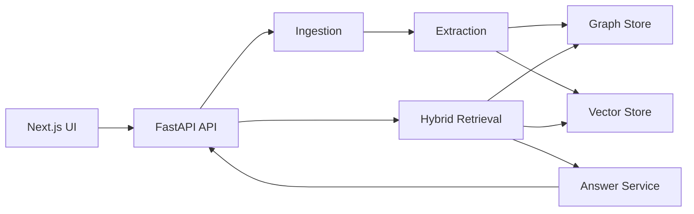

# GraphIntel

GraphIntel is a Graph RAG platform for support and incident intelligence. It
ingests operational documents, extracts entities and relationships, builds a
queryable knowledge graph, and answers questions with citations, reasoning
paths, confidence labels, and refusal behavior when evidence is insufficient.

The project is designed to be easy to run locally and realistic to deploy:
local development uses SQLite, a SQL-backed graph mirror, deterministic
embeddings, and deterministic answer/extraction fallbacks; AWS staging and
production are expected to use PostgreSQL/pgvector, Amazon Neptune, managed
Redis, real embeddings, and a real LLM provider.

## Features

- Source-grounded answers with citations and visible graph reasoning paths.
- Hybrid retrieval that combines entity linking, graph expansion, vector search,
  merge/rerank logic, and grounded answer generation.
- Human review workflows for entity edits, duplicate merges, relation changes,
  ontology validation, and audit history.
- Deterministic local demo data and golden-question evaluation.
- Offline CI path for backend tests, data validation, linting, Docker builds,
  Terraform validation, and frontend tests.
- AWS infrastructure-as-code for ECS Fargate, RDS PostgreSQL, Amazon Neptune,
  ElastiCache Redis, S3, ECR, ALB, Secrets Manager, and CloudWatch.

## Architecture



| Layer | Local development | AWS staging/production |
| --- | --- | --- |
| API | FastAPI | ECS Fargate behind ALB |
| Frontend | Next.js | ECS Fargate standalone Next.js app |
| Relational data | SQLite or PostgreSQL | RDS PostgreSQL |
| Graph traversal | SQL-backed graph mirror | Amazon Neptune |
| Vectors | Deterministic hash embeddings | pgvector with Bedrock/FastEmbed/Voyage embeddings |
| LLM | Deterministic fallback | Anthropic Claude or another configured provider |
| Queue/cache | Redis container | ElastiCache Redis |

## Repository Structure

```text
backend/
  app/
    api/routers/      REST endpoints
    services/         ingestion, extraction, retrieval, answer, evaluation
    config.py         typed environment-driven settings
    graph.py          SQL graph mirror and Neptune adapter
    vector.py         embedding providers and vector search
  tests/              backend test suite
frontend/             Next.js 16, React 19, TypeScript, Tailwind, React Flow
scripts/              demo data download/generation/validation
data/                 tracked fixtures plus ignored generated data folders
docs/                 architecture, deployment, testing, dataset notes
infra/terraform/      AWS infrastructure
.github/workflows/    CI and gated deploy workflows
```

## Prerequisites

- Python 3.11+
- Node.js 20+
- Docker Desktop, for containerized local runs and image builds
- Terraform 1.5+, only when validating or deploying AWS infrastructure

## Quick Start

Run the backend fully offline:

```bash
pip install -e ".[dev,llm]"
python scripts/prepare_demo_data.py
uvicorn app.main:app --app-dir backend --port 8000
```

Seed demo data and run a smoke test from another shell:

```bash
curl -X POST http://localhost:8000/admin/seed
BASE=http://localhost:8000 bash infra/smoke_test.sh
```

Ask a grounded question:

```bash
curl -X POST http://localhost:8000/ask \
  -H "Content-Type: application/json" \
  -d '{"question":"Which engineering team owns the service involved in INC-247?"}'
```

Interactive API documentation is available at `http://localhost:8000/docs`.

## Frontend

```bash
cd frontend
npm install
npm run dev
```

The frontend defaults to `NEXT_PUBLIC_API_BASE=http://localhost:8000`. Copy
`frontend/.env.local.example` to `frontend/.env.local` only when the backend is
running elsewhere.

## Docker Compose

The local Compose stack runs API, web, PostgreSQL/pgvector, and Redis:

```bash
cp .env.example .env
docker compose up -d --build
```

Production graph traversal is Amazon Neptune; local graph traversal uses the
SQL-backed mirror.

## Configuration

Configuration is environment-driven through `backend/app/config.py`.

Important variables:

| Variable | Local default | Production expectation |
| --- | --- | --- |
| `GRAPHINTEL_ENV` | `local` | `staging` or `production` |
| `DATABASE_URL` | optional SQLite override | RDS PostgreSQL DSN from Secrets Manager |
| `GRAPH_BACKEND` | `sql` | `neptune` |
| `NEPTUNE_ENDPOINT` | empty | Terraform Neptune endpoint output |
| `LLM_PROVIDER` | `deterministic` | real provider, for example `anthropic` |
| `EXTRACTION_PROVIDER` | `deterministic` | `llm` |
| `EMBEDDING_PROVIDER` | `deterministic` | `bedrock`, `fastembed`, or `voyage` |
| `CORS_ALLOW_ORIGINS` | `*` | explicit production frontend origins |

Use [.env.example](.env.example) as the template. Do not commit `.env` files or
real credentials.

## API Surface

| Area | Endpoints |
| --- | --- |
| Ingestion | `POST /ingest/upload`, `POST /ingest/text`, `GET /jobs`, `GET /documents`, `GET /documents/{id}/chunks` |
| Graph review | `GET/PATCH /entities`, `POST /entities/merge`, `GET/POST/DELETE /relations`, `GET /graph`, `GET /graph/expand` |
| Question answering | `POST /ask`, `GET /answers/{id}` |
| Evaluation | `POST /eval/run`, `GET /eval/latest`, `GET /eval/release-gate` |
| Admin/meta | `POST /admin/seed`, `GET /admin/stats`, `GET /audits`, `GET /health`, `GET /ready` |

## Demo Data

`scripts/prepare_demo_data.py` attempts public downloads, falls back to
deterministic synthetic data when needed, and writes ignored generated artifacts
under `data/raw`, `data/synthetic`, and `data/processed`. The tracked fixtures
under `data/fixtures` support regression tests and evaluation.

```bash
python scripts/prepare_demo_data.py
python scripts/validate_demo_data.py
```

Generated datasets are intentionally ignored by Git to keep the public
repository small and reproducible.

## Testing

```bash
pytest -q
ruff check backend scripts

cd frontend
npm install
npm run test
npm run typecheck
npm run lint
npm run build
```

The backend suite currently contains 50 deterministic tests covering ingestion,
extraction, graph operations, retrieval, answer generation, evaluation, config
safety checks, and API behavior.

## Deployment

AWS deployment assets live in [infra](infra). The target architecture uses ECS
Fargate, RDS PostgreSQL, Amazon Neptune, ElastiCache Redis, S3, ECR, ALB,
Secrets Manager, and CloudWatch.

The deploy workflow is intentionally gated: it is a no-op until repository
variables and an OIDC deploy role are configured. Local development never
requires AWS credentials.

## Security

- No production secrets are committed.
- `.env`, Terraform state, local databases, dependency folders, and build
  outputs are ignored.
- Managed environments reject SQLite, deterministic providers, wildcard CORS,
  missing Neptune configuration, and placeholder provider keys.
- Store production credentials in AWS Secrets Manager or an equivalent secret
  manager.

## Documentation

- [Architecture](docs/architecture/GRAPHINTEL_ARCHITECTURE.md)
- [Dataset plan](docs/DATASET_PLAN.md)
- [Testing](docs/testing.md)
- [AWS deployment plan](docs/deployment/AWS_DEPLOYMENT_PLAN.md)
- [Infrastructure runbook](infra/README.md)
- [Frontend documentation](frontend/README.md)

## License

No license file is currently included. Add a license before distributing or
accepting external contributions.
