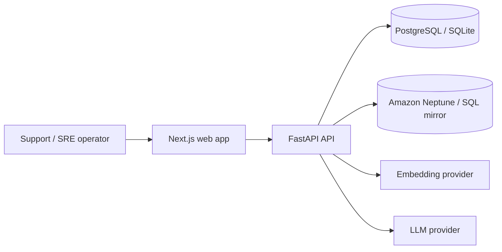

# GraphIntel Architecture

## Purpose

GraphIntel is a Graph RAG application for operational support intelligence. It
links support tickets, incidents, services, teams, runbooks, postmortems, SLA
clauses, and root causes into a graph, then combines graph traversal with vector
retrieval to answer operational questions from evidence.

## System Context

Local development uses SQLite, the SQL graph mirror, deterministic embeddings,
and deterministic answer/extraction fallbacks. Staging and production should use
managed services: RDS PostgreSQL, Amazon Neptune, real embeddings, and a real
LLM provider.

## Backend Modules

| Module | Responsibility |
| --- | --- |
| `api/routers` | HTTP routes for ingestion, graph review, asking questions, evaluation, and admin actions |
| `services/ingestion.py` | Normalizes uploaded or imported records, creates documents and chunks |
| `services/extraction.py` | Extracts entities and relations with deterministic or LLM-backed providers |
| `graph.py` | Defines the graph-store interface, SQL graph mirror, Neptune adapter, and traversal behavior |
| `vector.py` | Embedding providers and in-process vector search abstraction |
| `services/retrieval.py` | Query planning, entity linking, graph expansion, vector search, and reranking |
| `services/answer.py` | Evidence packaging, answer generation, confidence, citations, and refusal behavior |
| `services/evaluation.py` | Golden-question evaluation and release-gate status |
| `config.py` | Typed, environment-driven settings and production safety checks |

## Storage Model

| Store | Local | Production |
| --- | --- | --- |
| Documents, chunks, jobs, answers, audits | SQLite | RDS PostgreSQL |
| Graph traversal | SQL graph mirror | Amazon Neptune |
| Chunk embeddings | JSON vectors / deterministic provider | pgvector-compatible storage and real embeddings |
| Raw files | Local generated data folders | S3 |

The SQL graph mirror is retained locally for deterministic testing and offline
development. Neptune is the production graph backend.

## Retrieval Flow

1. The user submits a question to `POST /ask`.
2. The retrieval service builds a query plan: intent, entity mentions, required
   evidence types, and optional time constraints.
3. Entity linking maps query mentions to graph nodes.
4. Graph expansion finds relevant multi-hop neighborhoods.
5. Vector search retrieves candidate chunks from graph-linked and global text.
6. Results are merged and reranked.
7. The answer service builds a cited evidence packet.
8. The configured answer provider returns a grounded answer or refusal.
9. The answer, citations, reasoning path, confidence, and limitations are stored.

## Ingestion Flow

1. Upload text or files, or prepare the demo import corpus.
2. Create an ingestion job.
3. Parse records into normalized documents.
4. Chunk document content with metadata.
5. Extract entities and relations.
6. Validate relations against the ontology.
7. Upsert SQL records and graph edges.
8. Generate and store embeddings.
9. Update job status and per-record errors.

## Reliability Principles

- Local tests must not require external services.
- Production must not run with SQLite, deterministic embeddings, deterministic
  LLM behavior, wildcard CORS, or missing Neptune configuration.
- Answers must expose citations and graph reasoning paths.
- Unsupported or weakly supported questions should refuse rather than fabricate.
- Human graph corrections must be auditable.
